# MovieMatch

A social movie discovery platform where friends can swipe on movies, create watch parties, and find common movie preferences. Built with modern full-stack technologies.

## Features

- **Movie Swiping System** - Like, dislike, or mark movies as watched with an intuitive card-based interface
- **Friend Management** - Send/receive friend requests, manage connections, and block users
- **Watch Parties** - Create parties, invite friends, and discover movies that match everyone's preferences
- **Movie Database** - Populated with trending movies from The Movie Database (TMDB) with automatic daily sync
- **User Profiles** - View and manage your profile, liked movies, and activity
- **Real-time Movie Matching** - Find common movies between you and your friends
- **Mobile-first Interface** - Optimized for mobile devices with a responsive design

## Screenshots

### User Profile & Navigation

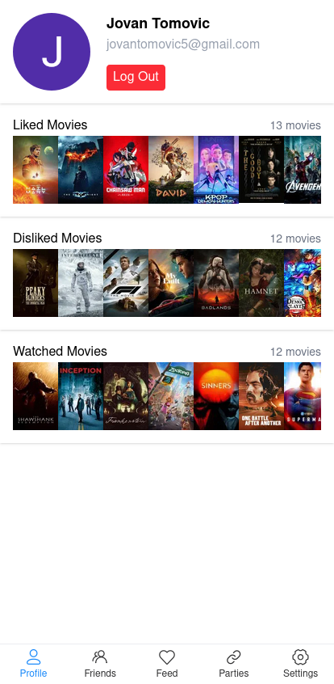

_User profile view with account management_

### Movie Swiping Interface

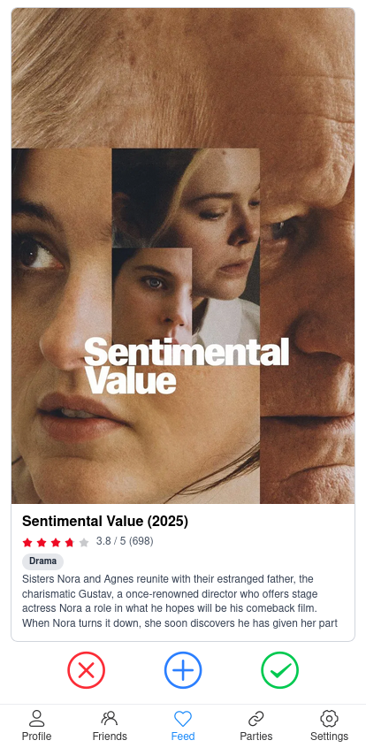

_Core swiping interface to discover and rate movies_

### Liked Movies Collection

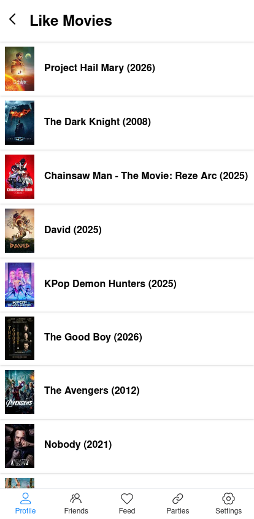

_View your collection of liked movies_

### Friends Management

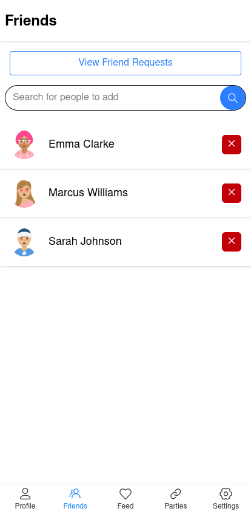

_Manage your connections and friend network_

### Friend Requests

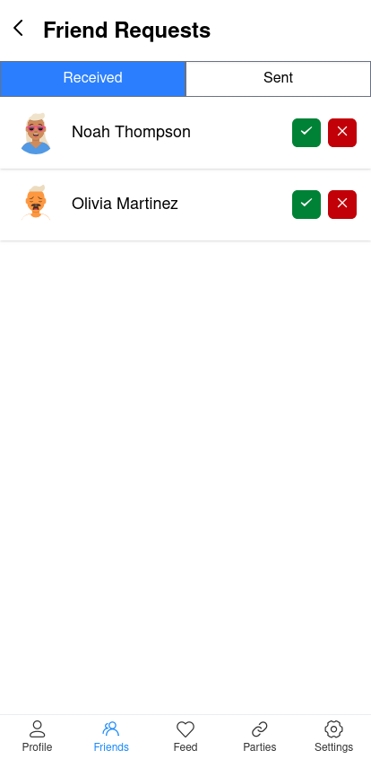

_Incoming and outgoing friend requests_

### Search for Friends

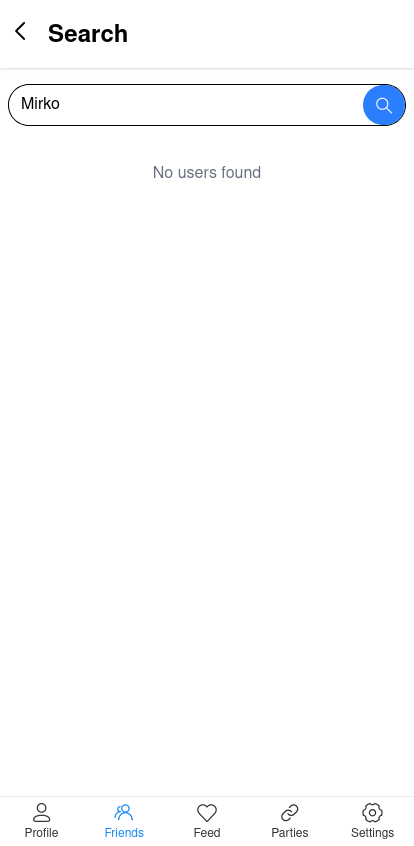

_Discover and connect with other users_

### Watch Parties

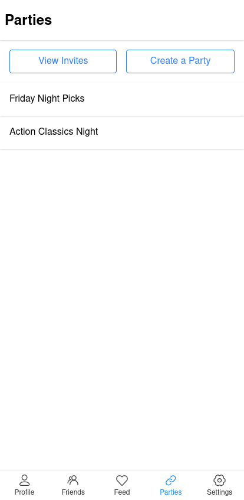

_View and manage your watch parties_

### Create a Party

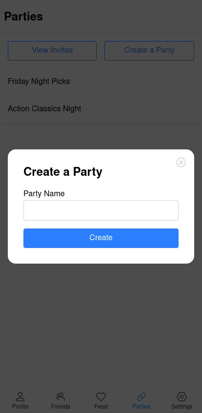

_Set up a new watch party with friends_

### Party Members

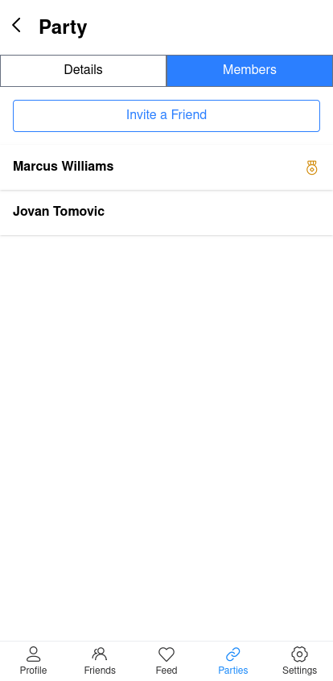

_View members participating in a party_

### Party Details

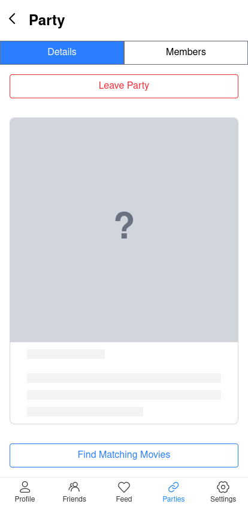

_Party information and settings_

### Matched Movie Result

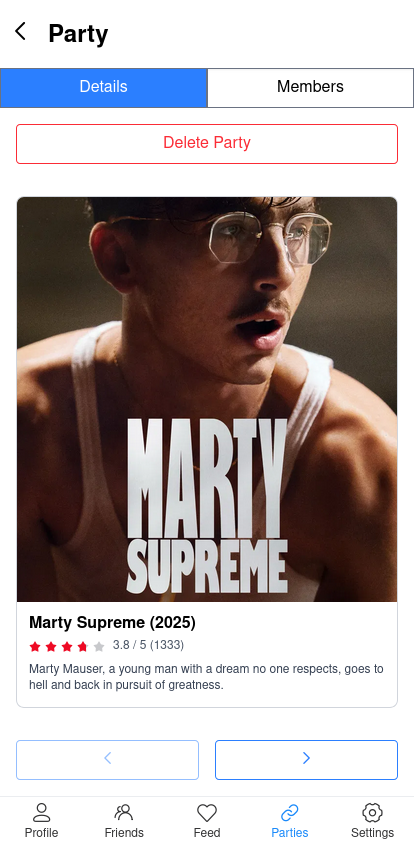

_Movie that matches all party members' preferences_

## Tech Stack

### Frontend

- **Vue.js 3** - Modern reactive UI framework
- **TypeScript** - Type-safe JavaScript development
- **Tailwind CSS 4** - Utility-first CSS framework
- **Vant UI** - Mobile-oriented component library
- **Vue Router** - Client-side routing
- **Axios** - HTTP client
- **Vite** - Next-generation build tool

### Backend

- **Node.js + Express.js** - Server framework
- **TypeScript** - Type-safe backend development
- **Prisma ORM** - Modern database ORM
- **PostgreSQL** - Relational database
- **Better-Auth** - Authentication & session management
- **Node-Cron** - Scheduled job execution (TMDB sync)
- **Zod** - Schema validation

### Infrastructure

- **Docker & Docker Compose** - Containerization
- **pnpm** - Fast package manager
- **Nodemon** - Development server auto-reload

## Getting Started

### Prerequisites

- **Node.js** (v18 or higher)
- **pnpm** (https://pnpm.io/)
- **PostgreSQL** (v12 or higher)
- **Docker & Docker Compose** (optional, for containerized setup)

### Installation

1. **Clone the repository**

   ```bash
   git clone https://github.com/tomovicj/moviematch
   cd moviematch
   ```

2. **Install dependencies**

   ```bash
   pnpm install
   ```

3. **Set up environment variables**

   Rename the `.env.example` files to `.env` in both `server` and `client` directories:
    ```bash
    mv server/.env.example server/.env
    mv client/.env.example client/.env
    ```
    Then fill in the values

### Database Setup

1. **Start PostgreSQL** (if not using Docker)

   ```bash
   # macOS with Homebrew
   brew services start postgresql

   # Linux
   sudo systemctl start postgresql

   # Windows
   # Use PostgreSQL installer or WSL
   ```

2. **Create database**

   ```bash
   createdb moviematch
   ```

3. **Run Prisma migrations**

   ```bash
   cd server
   pnpm db:push
   # or for full migrations
   pnpm prisma migrate deploy
   ```

4. **Seed the database (optional)**
   ```bash
   cd server
   pnpm db:seed
   ```

### Running the Development Servers

**Option 1: Using Docker Compose** (Recommended)

```bash
docker-compose up
```

This will start:

- PostgreSQL database on port 5432
- Backend API on port 3000
- Frontend on port 5173

**Option 2: Manual Setup**

Terminal 1 - Start the backend:

```bash
cd server
pnpm dev
```

Backend runs on `http://localhost:3000`

Terminal 2 - Start the frontend:

```bash
cd client
pnpm dev
```

Frontend runs on `http://localhost:5173`

### Getting TMDB API Key

1. Visit https://www.themoviedb.org/settings/api
2. Create an API key
3. Add it to your `server/.env` as `TMDB_API_KEY`

The application will automatically sync popular movies daily via scheduled job.

## Project Structure

```
moviematch/
├── client/                 # Vue.js frontend application
│   ├── src/
│   │   ├── components/    # Reusable Vue components
│   │   ├── pages/         # Page components (views)
│   │   ├── stores/        # Pinia state management
│   │   ├── router/        # Vue Router configuration
│   │   └── types/         # TypeScript type definitions
│   ├── package.json
│   └── vite.config.ts
│
├── server/                 # Express.js backend
│   ├── src/
│   │   ├── routes/        # API route handlers
│   │   ├── middleware/    # Express middleware
│   │   ├── services/      # Business logic
│   │   ├── jobs/          # Scheduled jobs
│   │   └── utils/         # Utility functions
│   ├── prisma/
│   │   └── schema.prisma  # Database schema
│   ├── package.json
│   └── tsconfig.json
│
├── docker-compose.yml     # Docker services configuration
├── .env.example          # Environment variables template
└── README.md             # This file
```

## Architecture

### Frontend-Backend Communication

- REST API using Express.js
- Axios HTTP client with interceptors
- Authentication via Better-Auth sessions

### Authentication Flow

1. User registers/logs in via Better-Auth
2. Session token stored in browser
3. Axios interceptor adds token to API requests
4. Backend validates session before processing requests

### Key Data Models

- **User** - User accounts and profiles
- **Movie** - Movie catalog from TMDB
- **Swipe** - User movie ratings (liked/disliked/watched)
- **Party** - Watch party groups
- **PartyInvitation** - Party membership requests
- **Friendship** - User connections
- **Block** - Blocked user relationships

## Learning Highlights

This project demonstrates proficiency in:

- **Full-Stack Development** - Complete end-to-end application from database to UI
- **Modern TypeScript** - Type-safe code across frontend and backend
- **Database Design** - Relational database modeling with Prisma ORM
- **Authentication & Authorization** - Session-based auth with Better-Auth
- **API Design** - RESTful API with proper error handling
- **Responsive UI** - Mobile-first design with Tailwind CSS and Vant
- **Component Architecture** - Reusable, maintainable Vue components
- **Containerization** - Docker and Docker Compose setup
- **Scheduled Jobs** - Automated TMDB data synchronization
- **Development Workflow** - pnpm workspaces, linting, and Git practices

## Future Enhancements

- **Real-time Notifications** - WebSocket support for friend requests and party updates
- **Advanced Matching Algorithm** - Machine learning-based recommendations
- **Social Sharing** - Share movie preferences on social media
- **Production Deployment** - Deploy to cloud platforms (Vercel, Heroku, AWS, etc.)
- **Streaming Integration** - Show where movies are available to stream
- **User Statistics** - Analytics dashboard for viewing habits
- **Dark Mode** - Theme switching support
- **Performance Optimization** - Caching, pagination, lazy loading

## License

This project is open source and available under the [MIT License](LICENSE).

## Contact

Created by Jovan Tomovic - feel free to reach out!

- GitHub: [@tomovicj](https://links.jovantomovic.com/github)
- LinkedIn: [Jovan Tomovic](https://links.jovantomovic.com/linkedin)
- Email: contact@jovantomovic.com
